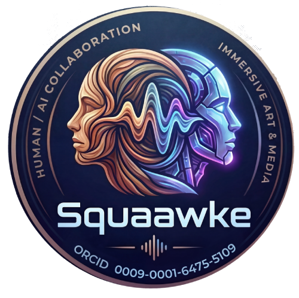

# SQAAWKE: A Bridge to ACE-Step Local Models with Integrations for Ableton Live and Claude by Anthropic API

<div align="center">



**Human | AI Collaboration in Immersive Art & Media**

[](https://github.com/ace-step/ACE-Step)
[](https://github.com/ServeurpersoCom/acestep.cpp)
[](https://www.anthropic.com/claude)
[](LICENSE)
[](https://orcid.org/0009-0001-6475-5109)

</div>

---

Local deployment of ACE-Step music generation system with quantized models for CPU/Metal inference.

> **Built upon**: [ACE-Step](https://github.com/ace-step/ACE-Step) — A foundation model for music generation  
> **Inference engine**: [acestep.cpp](https://github.com/ServeurpersoCom/acestep.cpp) — Portable C++ implementation with GGML  
> **Co-created with**: [Claude](https://www.anthropic.com/claude) by Anthropic — AI pair programming partner

This project extends ACE-Step with a web-based interface, AI composition assistant, and streamlined local deployment.

## Features

- **Text-to-music generation** via quantized language models (0.6B–4B)
- **DiT-based audio synthesis** with VAE decoding
- **AI-assisted composition** using Claude (Anthropic API)
- **Web UI** for generation control and playback
- **Metal acceleration** on macOS (automatically detected)

## 🤖 About This Project

This project was **co-created through human-AI collaboration** with Claude by Anthropic serving as an AI pair programming partner. The human provided vision, direction, and decision-making, while Claude contributed code development, documentation, security auditing, and best practices implementation.

We believe in **transparent attribution** for all contributors—human and AI alike. See `CONTRIBUTORS.md` for details about our collaboration model and why we credit AI contributions.

### 👥 Project Team

**Human Developer & Vision**  
[](https://github.com/inoculate23)
[](https://orcid.org/0009-0001-6475-5109)

**AI Development Partner**  
[](https://www.anthropic.com/claude)

## Setup

### Prerequisites

- macOS, Linux, or Windows with WSL
- Python 3.8+
- cmake
- git
- ~3.3 GB disk space (for base models)

### Installation

```bash
# 1. Clone the repository
git clone https://github.com/inoculate23/squaawke.git
cd squaawke

# 2. Run setup (builds acestep.cpp + downloads models)
./setup.sh

# 3. Configure environment (optional)
cp .env.example .env
# Edit .env to customize PORT or model choices
```

## Running

```bash
python3 app.py
```

Then open: **http://localhost:5003**

## Environment Variables

Create a `.env` file in the project root:

```bash
# Server port
PORT=5003

# Model selection (must exist in models/ directory)
LM_MODEL=acestep-5Hz-lm-0.6B-Q8_0.gguf
DIT_MODEL=acestep-v15-turbo-Q4_K_M.gguf

# Optional: Anthropic API key for AI composition assistant
# (Users can also provide their key in the web UI)
# ANTHROPIC_API_KEY=sk-ant-...
```

### API Keys

The **AI Compose** feature requires an Anthropic API key. You can either:

1. **Provide in UI**: Users enter their API key in the web interface (recommended for multi-user scenarios)
2. **Environment variable**: Set `ANTHROPIC_API_KEY` in `.env` (single-user convenience)

**Never commit API keys to version control.** The `.env` file is gitignored.

## Model Options

### Language Models (LM)
- `acestep-5Hz-lm-0.6B-Q8_0.gguf` — Fast (710 MB)
- `acestep-5Hz-lm-1.7B-Q8_0.gguf` — Balanced (1.98 GB)
- `acestep-5Hz-lm-4B-Q5_K_M.gguf` — Quality (3.03 GB)

### DiT Models
- `acestep-v15-turbo-Q4_K_M.gguf` — Fastest (1.45 GB)
- `acestep-v15-turbo-Q5_K_M.gguf` — Balanced (1.70 GB)
- `acestep-v15-base-Q4_K_M.gguf` — Base version (1.45 GB)
- `acestep-v15-sft-Q4_K_M.gguf` — Steered (1.45 GB)

Download additional models:
```bash
cd models
huggingface-cli download Serveurperso/ACE-Step-1.5-GGUF \
  acestep-5Hz-lm-4B-Q5_K_M.gguf --local-dir .
```

## Project Structure

```
.
├── app.py                  # Flask server & generation pipeline
├── setup.sh                # Build script (acestep.cpp + models)
├── download_models.sh      # Alternative model downloader
├── .env.example            # Environment template
├── models/                 # GGUF model files (gitignored)
├── acestep.cpp/            # C++ inference engine (submodule)
├── demucs_live/            # Audio separation (optional)
├── demucs_max/             # Audio processing (optional)
└── templates/              # Web UI HTML
```

## Technical Details

- **Backend**: Flask (Python)
- **Inference**: acestep.cpp (C++) with Metal/CPU support
- **Models**: Quantized GGUF format (Q4_K_M, Q5_K_M, Q8_0)
- **Audio**: 44.1kHz 16-bit WAV output
- **Composition AI**: Claude 3.5 Haiku (Anthropic API)

## Outputs

Generated audio is saved to:
- **macOS**: `~/Music/AceStep-Local/`
- **Linux/Windows**: Adjust `OUTPUT_DIR` in `app.py`

## Troubleshooting

### Build errors
- Ensure cmake is installed: `brew install cmake` (macOS) or `apt install cmake` (Linux)
- Check submodules: `git submodule update --init --recursive`

### Model not found
- Run `./setup.sh` to download base models
- Verify files exist in `models/` directory
- Check `.env` model filenames match downloaded files

### Out of memory
- Use smaller models (0.6B LM + turbo Q4_K_M DiT)
- Reduce generation length
- Close other applications

## License

This project combines multiple components with their respective licenses:

- **This web interface & integration code**: MIT License (see LICENSE file)
- **acestep.cpp** (inference engine): MIT License — [Repository](https://github.com/ServeurpersoCom/acestep.cpp)
- **ACE-Step models**: Apache 2.0 License — [Original project](https://github.com/ace-step/ACE-Step)
- **GGML**: MIT License (included in acestep.cpp)

See `CREDITS.md` for full attribution and `CONTRIBUTORS.md` for information about the human-AI collaboration that built this project.

## Credits & Acknowledgments

This project stands on the shoulders of giants:

### Foundation Model
- **[ACE-Step](https://github.com/ace-step/ACE-Step)** (4.2k ⭐) — The breakthrough music generation model
  - Authors: ChuxiJ, DumoeDss, and the ACE-Step team
  - Paper: "ACE-Step: A Step Towards Music Generation Foundation Model"
  - License: Apache 2.0

### Inference Engine
- **[acestep.cpp](https://github.com/ServeurpersoCom/acestep.cpp)** (151 ⭐) — Portable C++ implementation
  - Author: ServeurpersoCom
  - Features: GGML-based inference, Metal/CUDA/CPU support, quantization
  - License: MIT

### Quantized Models
- **[Serveurperso/ACE-Step-1.5-GGUF](https://huggingface.co/Serveurperso/ACE-Step-1.5-GGUF)** — Model weights in GGUF format
  - Quantizations: Q4_K_M, Q5_K_M, Q8_0 (efficient inference)

### AI Composition & Development
- **[Anthropic Claude](https://www.anthropic.com/)** — Powers the AI composition assistant AND co-created this integration project through AI pair programming

### Infrastructure
- **[GGML](https://github.com/ggerganov/ggml)** — Machine learning tensor library
- **Flask** — Web framework
- **Hugging Face** — Model hosting platform

See also: [ACE Studio](https://acestudio.ai/) — Professional version with real-time collaboration

## Security

⚠️ **Do not commit** `.env` files or API keys to version control.  
The `.gitignore` is configured to exclude:
- `.env` files
- Model weights (`*.gguf`, `*.safetensors`, etc.)
- API keys and credentials
- Build artifacts and caches

If you accidentally committed secrets, **revoke the keys immediately** and use tools like `git-filter-repo` to remove them from history.

---

## 📖 Citation

If you use Squaawke in your research or project, please cite:

```bibtex
@software{squaawke2026,
  author = {Craig Ellenwood (Github:inoculate23) and Claude (Anthropic AI)},
  title = {Squaawke: Local ACE-Step Music Generation with Human-AI Collaboration},
  year = {2026},
  publisher = {GitHub},
  url = {https://github.com/inoculate23/squaawke},
  note = {ORCID: 0009-0001-6475-5109}
}
```

**APA Style:**
```
Craig Ellenwood (Github:inoculate23), & Claude (Anthropic AI). (2026). Squaawke: Local ACE-Step Music Generation 
with Human-AI Collaboration [Computer software]. GitHub. 
https://github.com/inoculate23/squaawke
```

**MLA Style:**
```
Craig Ellenwood (Github:inoculate23), and Claude (Anthropic AI). Squaawke: Local ACE-Step Music Generation with 
Human-AI Collaboration. GitHub, 2026, https://github.com/inoculate23/squaawke.
```

[](https://orcid.org/0009-0001-6475-5109)
